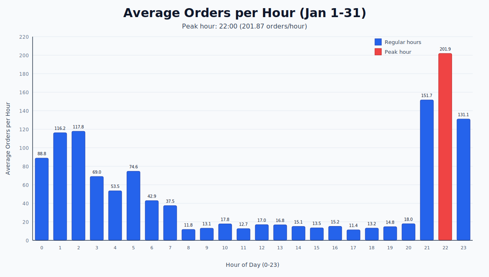
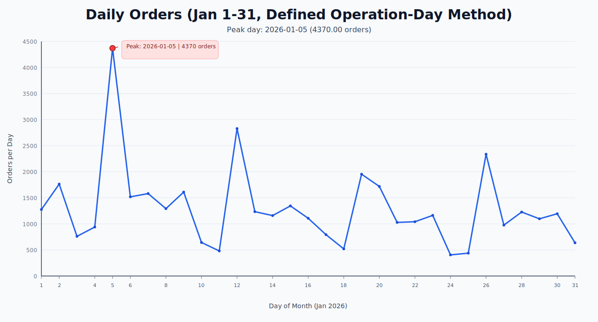
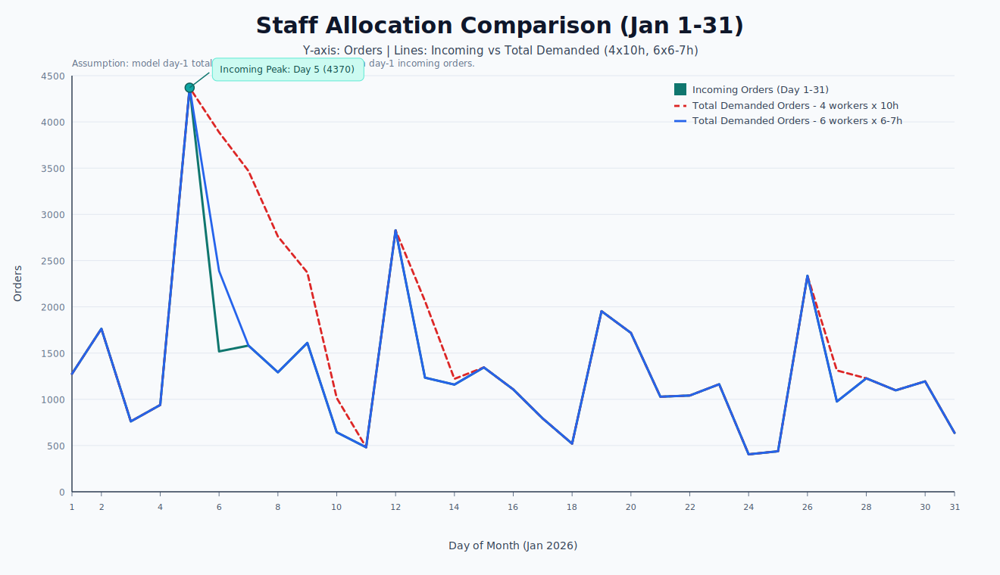

# Workforce Reallocation Throughput Stability
## Operations Case Study

This repository is a simulated fulfillment-operations case study built to compare two staffing strategies under realistic constraints:

- Model A: 4 workers x 10 hours
- Model B: 6 workers x 6-7 hours

Goal: test whether a higher-headcount, shorter-shift structure improves throughput stability and efficiency while controlling labor spend.


## Paper and Upload Guide
- Full paper: `docs/PAPER_CASE_STUDY.md`
- GitHub upload guide (CN): `docs/GITHUB_UPLOAD_GUIDE_CN.md`

## Background
In high-volume operations, instability is often driven by timing mismatch between incoming demand and effective labor capacity, not only total headcount.

This simulation recreates that problem with non-proprietary data logic and tests reallocation outcomes on:

- per-person hourly efficiency,
- backlog behavior,
- daily and total labor cost.

## Data Scope
Source file:

- `/Users/robinhu/Desktop/Robin/Simulated_Case_Study.csv`

Primary fields used:

- `Create Time`
- `Product Size (cm) L * W * H`

Operation-day definition used in this project:

- Day 2 uses `Jan 1 09:00:00` to `Jan 2 08:59:59`
- Day 15 uses `Jan 14 09:00:00` to `Jan 15 08:59:59`
- Analysis window for staffing simulation: Jan 2 to Jan 31 (30 operation days)

## Visual Outputs
### 1) Average hourly incoming orders (Jan 1-31)


### 2) Daily incoming orders with peak day marker


### 3) Staff allocation comparison (3 curves)
- Incoming Orders (Day 1-31)
- Total Demanded Orders: 4 workers x 10h
- Total Demanded Orders: 6 workers x 6-7h



## Simulation Algorithm
### Step 1: Build daily demand from Create Time
For each record, assign operation day by timestamp:

- if `Create Time >= 09:00`, assign to next day
- else assign to same day

This produces daily incoming order counts for the simulation window.

### Step 2: Convert product size to total volume
For each row:

- parse 3 dimensions from `Product Size (cm) L * W * H`
- compute `total_volume = length * width * height`

### Step 3: Randomized per-order handling time by volume bucket
Each order gets stochastic handling seconds:

- `volume <= 250`: random 8-14 sec
- `250 < volume <= 500`: random 10-15 sec
- `500 < volume <= 1000`: random 12-16 sec
- `1000 < volume <= 2000`: random 13-18 sec (explicit bridge assumption)
- `volume > 2000`: random 15-20 sec

Random seed is fixed in code to keep runs reproducible.

### Step 4: Simulate capacity and fatigue by model
Model A (4x10):

- workers = 4, shift = 10h
- after first 6 hours, fatigue factor sampled from 1.3-1.4
- this means remaining hours process slower (effective capacity reduced)

Model B (6x6-7):

- workers = 6, shift randomly sampled between 6.0 and 7.0 hours
- no extra fatigue penalty after 6 hours in this simulation

### Step 5: Enforce backlog thresholds
Daily threshold rules:

- Model A: demand above 2000 orders rolls to next day backlog
- Model B: demand above 3500 orders rolls to next day backlog

### Step 6: Compute key KPIs
For each day and model:

- `total_demand_orders = backlog_start + incoming_orders`
- `processed_orders` constrained by model capacity
- `backlog_end_orders`
- `orders_per_person_hour = processed_orders / (workers * shift_hours)`
- `daily_labor_cost = workers * shift_hours * 18`

## Result Summary (from generated outputs)
From `data/processed/staff_allocation_efficiency_summary.csv`:

| Metric | 4 workers x 10h | 6 workers x 6-7h |
|---|---:|---:|
| Avg orders/person/hour | 32.6308 | 33.7127 |
| Avg daily processed orders | 1305.2333 | 1305.2333 |
| Avg backlog end orders | 269.5 | 29.0 |
| Days with backlog | 8 | 1 |
| Total labor cost ($18/h) | 21600.0 | 20836.8941 |
| Avg daily labor cost | 720.0 | 694.5631 |
| Labor cost per processed order | 0.5516 | 0.5321 |

Directional comparison:

- Per-person hourly efficiency: Model B higher by ~3.32%
- Total labor cost: Model B lower by ~3.53%
- Cost per processed order: Model B lower by ~3.54%
- Average ending backlog: Model B lower by ~89.24%

## Conclusion
Under the simulation assumptions and Jan demand profile, **6 workers x 6-7 hours** performs better than **4 workers x 10 hours** on both efficiency and labor cost while keeping total processed volume equal.

## Reproducibility
Run in this order:

```bash
python3 src/hourly_peak_avg.py
python3 src/daily_orders_9am_window.py
python3 src/staff_allocation_efficiency.py
python3 src/plot_hourly_peak_svg.py
python3 src/plot_daily_orders_line_svg.py
python3 src/plot_staff_allocation_comparison_svg.py
```

Outputs:

- `data/processed/jan_hourly_average_orders.csv`
- `data/processed/daily_orders_for_staff_allocation.csv`
- `data/processed/staff_allocation_daily_comparison.csv`
- `data/processed/staff_allocation_efficiency_summary.csv`
- `images/jan_hourly_average_orders.svg`
- `images/jan_daily_orders_with_peak.svg`
- `images/staff_allocation_comparison.svg`

## Repository Structure
- `src/`: simulation + visualization scripts
- `data/processed/`: computed tables and summaries
- `images/`: exported SVG charts

## Author
Robin Hu  
Operation & Supply Chain Analyst
